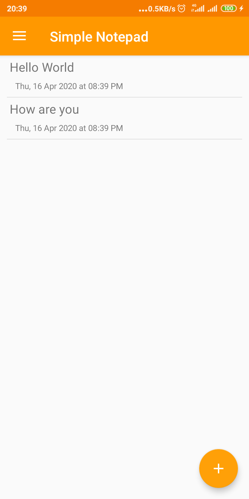
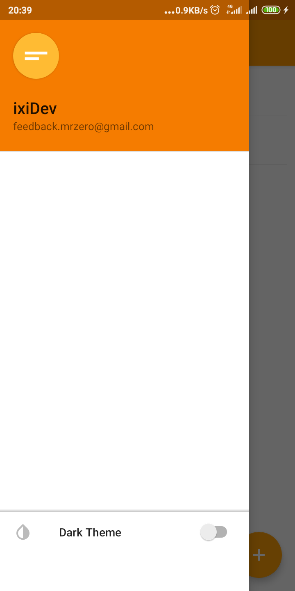
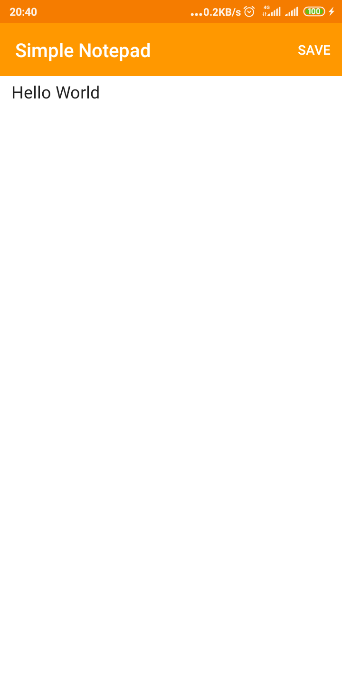
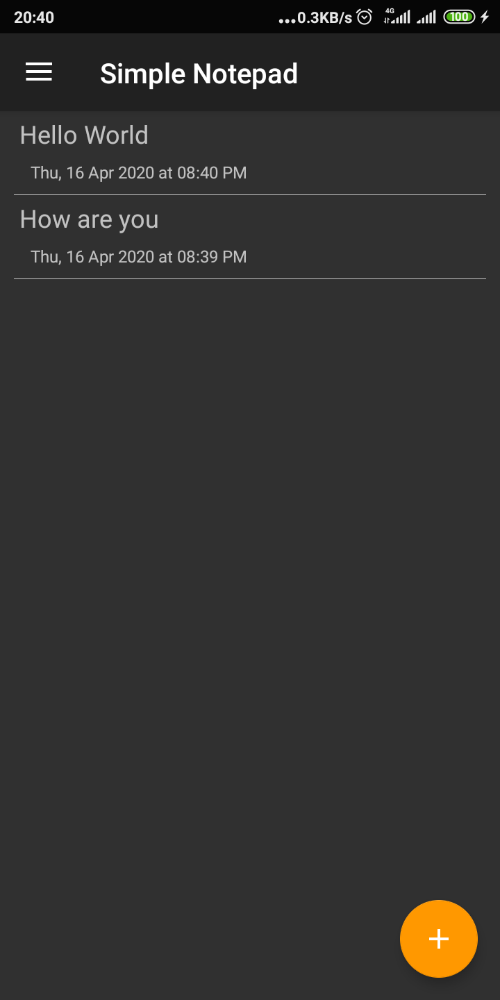
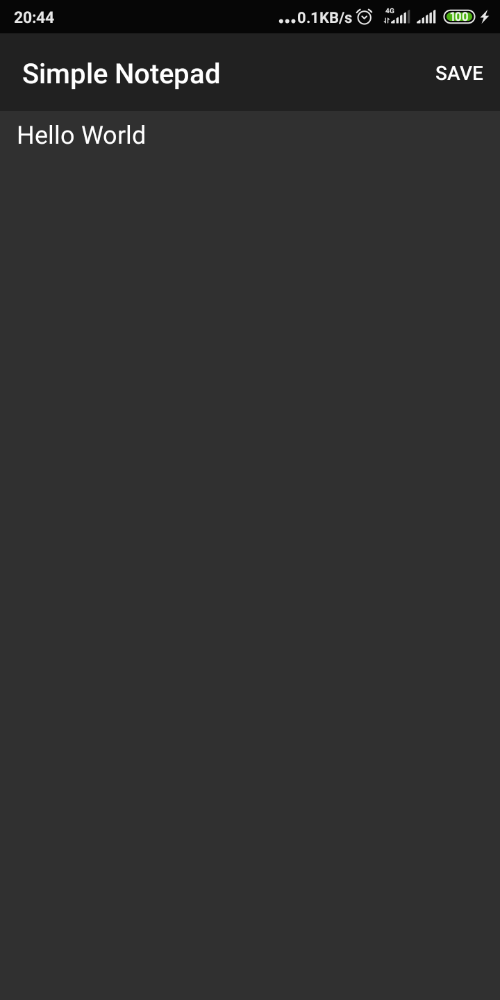

# SimpleNotepadAndroid
Saimple Notepad for android
Follow video tutorial on youtube : https://www.youtube.com/playlist?list=PL7hEgwbTA5AoItKHCZrK2LH_YkNkh4oDW

## Light

  
    
  

## Dark

  
    

